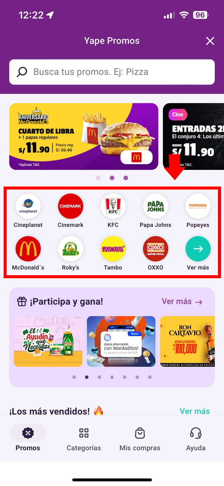
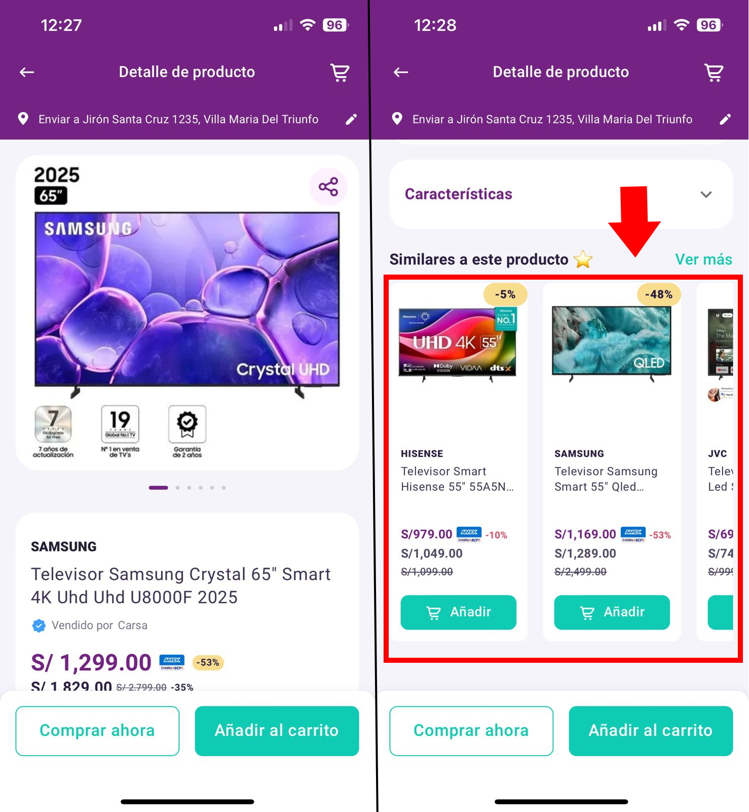
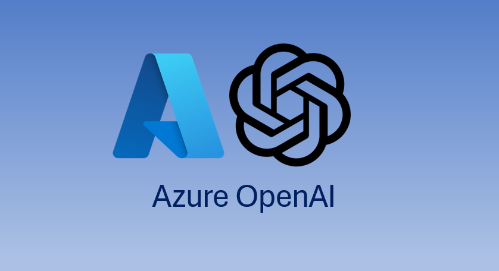

# Jean Paul Hernandez Rojo
**Machine Learning Engineer | Data Science | MLOps**

📧 jhernandezr@uni.pe | 📍 Lima, Perú  
[LinkedIn](https://linkedin.com/in/jean-paul-hernandez-rojo) | [GitHub](https://github.com/JeanPaulHernandezRojo)

---

## 🎯 Sobre mí
Machine Learning Engineer con +7 años de experiencia en desarrollo e implementación de modelos ML en producción, especializado en sistemas de recomendación, experimentación (A/B testing) y MLOps en el sector financiero y retail, asegurando serving de modelos para +18 millones de usuarios.

---

## 💼 Proyectos Destacados

> ⚠️ **Nota de Confidencialidad:** Por acuerdos de confidencialidad corporativa, algunos detalles técnicos específicos, métricas de negocio y datos sensibles han sido omitidos. Las imágenes adjuntas no comprometen información propietaria.

### Sistema de Recomendación de Comercios Destacados
<table>
  <tr>
    <td width="60%">
      <ul>
        <li><strong>Caso de uso:</strong> Seleccionar los 9 comercios más relevantes por cada usuario. (Total Comercios: +150)</li>
        <li><strong>Detalle:</strong> Se personaliza el componente con modelo ALS & Two Tower.</li>
      </ul>
    </td>
    <td width="40%">
      
    </td>
  </tr>
</table>

### Sistema de Recomendación de Promociones
<table>
  <tr>
    <td width="60%">
      <ul>
        <li><strong>Caso de uso:</strong> Seleccionar las 20 ofertas más relevantes por cada usuario. (Total Promociones: +1000)</li>
        <li><strong>Detalle:</strong> Se personaliza el componente con modelo ALS & Reglas comerciales.</li>
      </ul>
    </td>
    <td width="40%">
      
    </td>
  </tr>
</table>

### Sistema de Recomendación de cross-selling de promociones
<table>
  <tr>
    <td width="60%">
      <ul>
        <li><strong>Caso de uso:</strong> Seleccionar las 6 ofertas más probables a que se compren a continuación. (Total Promociones: +1000)</li>
        <li><strong>Detalle:</strong> Se personaliza el componente con modelo Prefix-Span & Reglas comerciales.</li>
      </ul>
    </td>
    <td width="40%">
      
    </td>
  </tr>
</table>

### Modelo de Uplift para Campañas de Cashback
<table>
  <tr>
    <td width="60%">
      <ul>
        <li><strong>Caso de uso:</strong> Identificar usuarios no orgánicos, que requieren campaña de cashback para comprar.</li>
        <li><strong>Detalle:</strong> Se acota el universo de usuarios (de millones a miles) y se personaliza el monto de cashback.</li>
      </ul>
    </td>
    <td width="40%">
      
    </td>
  </tr>
</table>

### Sistema de Recomendación de productos similares
<table>
  <tr>
    <td width="60%">
      <ul>
        <li><strong>Caso de uso:</strong> Seleccionar los 10 productos más relacionados al producto visualizado por el usuario. (Total SKUs: +160 mil)</li>
        <li><strong>Detalle:</strong> Se personaliza el componente con modelo Word-2-Vec.</li>
      </ul>
    </td>
    <td width="40%">
      
    </td>
  </tr>
</table>

### Sistema de Recomendación de cross-selling de productos
<table>
  <tr>
    <td width="60%">
      <ul>
        <li><strong>Caso de uso:</strong> Seleccionar los 6 productos más probables a que se compren a continuación. (Total SKUs: +160 mil)</li>
        <li><strong>Detalle:</strong> Se personaliza el componente con modelo FP-Growth.</li>
      </ul>
    </td>
    <td width="40%">
      
    </td>
  </tr>
</table>

### Módulo GenAI para Data Science
<table>
  <tr>
    <td width="60%">
      <ul>
        <li><strong>Caso de uso:</strong> Integrar modelos de Gen-AI como funciones aplicables a dataframes.</li>
        <li><strong>Detalle:</strong> Permite escalar tareas de clasificación, limpieza, extracción, enriquecimiento de datos en tablas.</li>
      </ul>
    </td>
    <td width="40%">
      
    </td>
  </tr>
</table>

---

## 🛠️ Tecnologías

**ML & AI:** Classification, Regression, NLP, Uplift, Clustering, Neural Networks, RecSys, OpenAI  
**MLOps:** MLflow, Statsig, Feature Store, Hyperparameter Tuning  
**Cloud & Big Data:** Azure, Databricks, GCP, PySpark  
**Programming:** Python, SQL, PL-SQL  
**Tools:** GitHub, Power BI, Tableau, Jira, Notion

---

## 🎓 Educación
- **Maestría en Inteligencia Artificial** - Universidad Nacional de Ingeniería (En curso)
- **Bachiller en Ingeniería de Sistemas** - Universidad Nacional de Ingeniería
- **Europe School on Recommender Systems 2024** - ACM RecSys, Italia

---

## 📜 Certificaciones
- Databricks Machine Learning Associate (2025)
- Especialización en Data Science y Machine Learning con Python (2023)

---

## 📫 Contacto
Disponible para proyectos de ML/AI y consultoría en ciencia de datos.

💼 [Ver perfil completo en LinkedIn](https://linkedin.com/in/jean-paul-hernandez-rojo)
